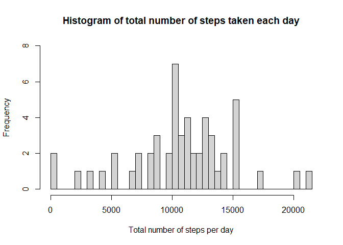
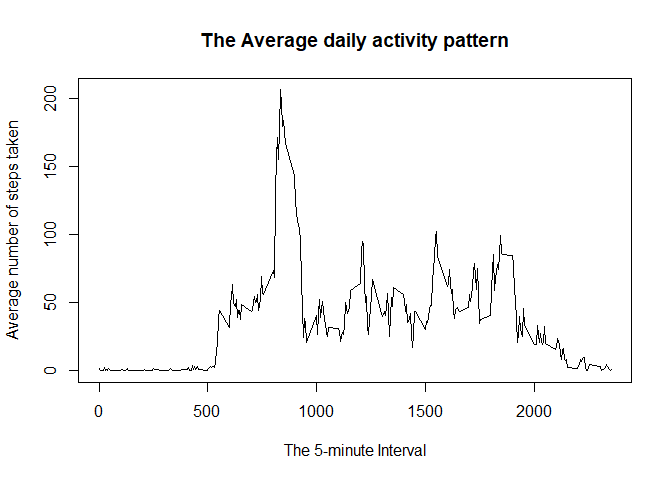
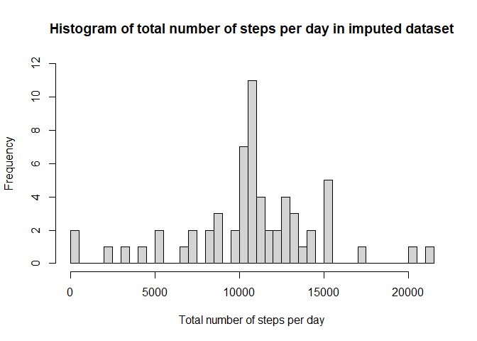
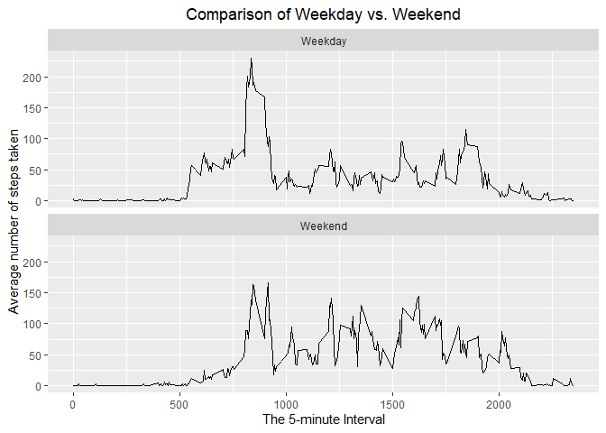

RepData\_PeerAssessment1
================
3/14/2022

## Loading and preprocessing the data

``` r
data <- read.csv("activity.csv")
str(data)
```

    ## 'data.frame':    17568 obs. of  3 variables:
    ##  $ steps   : int  NA NA NA NA NA NA NA NA NA NA ...
    ##  $ date    : chr  "2012-10-01" "2012-10-01" "2012-10-01" "2012-10-01" ...
    ##  $ interval: int  0 5 10 15 20 25 30 35 40 45 ...

``` r
#View (data)
data$date <- as.Date(data$date)
```

``` r
# What is mean total number of steps taken per day?
## Calculate the total number of steps taken per day
library(dplyr)
```

    ## 
    ## Attaching package: 'dplyr'

    ## The following objects are masked from 'package:stats':
    ## 
    ##     filter, lag

    ## The following objects are masked from 'package:base':
    ## 
    ##     intersect, setdiff, setequal, union

``` r
library(ggplot2)
steps_day <- data %>% group_by(date) %>% summarise(total_steps=sum(steps))
str(steps_day)
```

    ## tibble [61 x 2] (S3: tbl_df/tbl/data.frame)
    ##  $ date       : Date[1:61], format: "2012-10-01" "2012-10-02" ...
    ##  $ total_steps: int [1:61] NA 126 11352 12116 13294 15420 11015 NA 12811 9900 ...

``` r
# View(steps_day)

## Make a histogram of the total number of steps taken each day.
hist(steps_day$total_steps, 
     xlab = "Total number of steps per day", 
     main = "Histogram of total number of steps taken each day", 
     ylim=c(0, 8), breaks = 50)
```

<!-- -->

``` r
## Calculate and report the mean and median of the total number of steps taken per day.
mean <- mean(steps_day$total_steps, na.rm = TRUE)
mean
```

    ## [1] 10766.19

``` r
median <- median(steps_day$total_steps, na.rm = TRUE)
median
```

    ## [1] 10765

## What is mean total number of steps taken per day?

``` r
## Make a time series plot (i.e. type = "l") of the 5-minute interval (x-axis)
## and the average number of steps taken, averaged across all days (y-axis).
#table(data$interval)
pattern_day <- data %>% group_by(interval) %>% summarise(total=mean(steps, na.rm = TRUE))
#View(pattern_day)
plot(pattern_day$interval, pattern_day$total, type = "l", xlab = "The 5-minute Interval", 
     ylab = "Average number of steps taken", main = "The Average daily activity pattern")
```

<!-- -->

``` r
## Which 5-minute interval, on average across all the days in the dataset, contains the maximum number of steps?
pattern_day$interval[pattern_day$total == max(pattern_day$total)]
```

    ## [1] 835

## What is the average daily activity pattern?

``` r
## Make a time series plot (i.e. type = "l") of the 5-minute interval (x-axis)
## and the average number of steps taken, averaged across all days (y-axis).
#table(data$interval)
pattern_day <- data %>% group_by(interval) %>% summarise(total=mean(steps, na.rm = TRUE))
#View(pattern_day)
plot(pattern_day$interval, pattern_day$total, type = "l", xlab = "The 5-minute Interval", 
     ylab = "Average number of steps taken", main = "The Average daily activity pattern")
```

<!-- -->

``` r
## Which 5-minute interval, on average across all the days in the dataset, contains the maximum number of steps?
pattern_day$interval[pattern_day$total == max(pattern_day$total)]
```

    ## [1] 835

## Imputing missing values

``` r
## Calculate and report the total number of missing values in the dataset 
## (i.e. the total number of rows with NAs)
sum(!complete.cases(data))
```

    ## [1] 2304

``` r
## Devise a strategy for filling in all of the missing values in the dataset. 
## The strategy does not need to be sophisticated. For example, you could use the mean/median for that day, or the mean for that 5-minute interval, etc.
data_1 <- cbind(data, pattern_day)
#View(data_1)

## Create a new dataset that is equal to the original dataset but with the missing data filled in by the average number of steps taken by 5-minute interval.
data_1$steps <- ifelse(is.na(data_1$steps), data_1$total, data_1$steps)
data_1 <- data_1[,c(1,2,3,5)]

## Make a histogram of the total number of steps taken each day 
## and Calculate and report the mean and median total number of steps taken per day. 
## Do these values differ from the estimates from the first part of the assignment? What is the impact of imputing missing data on the estimates of the total daily number of steps?
impu_steps_day <- data_1 %>% group_by(date) %>% summarise(total_steps=sum(steps))
#View(impu_steps_day)

hist(impu_steps_day$total_steps, 
     xlab = "Total number of steps per day", 
     main = "Histogram of total number of steps per day in imputed dataset", 
     ylim=c(0, 12), breaks = 50)
```

<!-- -->

``` r
impu_mean <- mean(impu_steps_day$total_steps, na.rm = TRUE)
impu_mean
```

    ## [1] 10766.19

``` r
impu_median <- median(impu_steps_day$total_steps, na.rm = TRUE)
impu_median
```

    ## [1] 10766.19

``` r
impu_median - median
```

    ## [1] 1.188679

``` r
## There's no differences on the average of total steps taken per day in both original and imputed datasets, although subtle difference in medians.
## Based on the histograms, we saw an increase of frequency between 10000 and 11000 steps per interval 
## since the average number of steps taken by 5-minute interval was used to fill the missing values.
```

## Are there differences in activity patterns between weekdays and weekends?

``` r
## Create a new factor variable in the dataset with two levels – “weekday” and “weekend” indicating whether a given date is a weekday or weekend day.
#?weekdays
#str(data_1)
data_1$date <- as.Date(data_1$date)
data_2 <- data_1 %>% mutate(days = ifelse(weekdays(date) %in% c("Saturday", "Sunday"), "Weekend", "Weekday"))
#str(data_2)
#View(data_2)
table(data_2$days)
```

    ## 
    ## Weekday Weekend 
    ##   12960    4608

``` r
data_2$days <- as.factor(data_2$days)

## Make a panel plot containing a time series plot (i.e.type = "l") of the 5-minute interval (x-axis) and the average number of steps taken, averaged across all weekday days or weekend days (y-axis). See the README file in the GitHub repository to see an example of what this plot should look like using simulated data.
new_pattern_day <- data_2 %>% group_by(days,interval) %>% summarise (total_mean=mean(steps))
```

    ## `summarise()` has grouped output by 'days'. You can override using the `.groups` argument.

``` r
#View(new_pattern_day)
plot <- ggplot(new_pattern_day, aes(interval, total_mean)) + 
        geom_line() +
        facet_wrap(~ days, nrow = 2 , ncol = 1) +
        labs(x="The 5-minute Interval", y="Average number of steps taken", title = "Comparison of Weekday vs. Weekend")+
        theme(plot.title = element_text(hjust = 0.5))
plot
```

<!-- -->

``` r
#dev.off()
```
